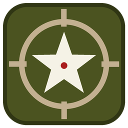

<p align="center"></p>

<h1 align="center">WWII Local Play Loadout Editor</h1>

<p align="center">
Use <b>every</b> weapon, camo, attachment, charm and perk in <b>Call of Duty: WWII Local Play</b> (offline LAN / split-screen),<br>
and unlock everything in the game's own menus.
</p>

<p align="center">Made by <b>Petsox</b></p>

---

In Local Play almost every weapon is locked, because the unlocks come from the online inventory, which isn't
available offline. The only way to get other guns was the Wanderlust perk, which swaps your weapon at random.
This tool fixes that. It edits your Local Play classes directly and can switch on the game's built-in
"unlock everything" mode for the menus.

> **Offline / Local Play only.** The tool reads and writes the game's memory. Never use it in online matches.

## Tested on

| | |
|---|---|
| Game | Call of Duty: WWII (PC), multiplayer executable `s2_mp64_ship.exe` |
| Game version | **1.25.0.1** (build changelist **2244937**) |
| `s2_mp64_ship.exe` | 48,417,280 bytes, SHA-256 `381C737EC7EF8141C1FF15A8BAAC044CECAA9C1CD8F329D3AC6E4A82BBF982FD` |
| OS | Windows 11 23H2 (10.0.22631), .NET Framework 4.8 |

Other game builds probably won't work. The tool locates most things by signature or by name, but a few memory
offsets are specific to this build. If an offset doesn't match, the tool reports it in its log rather than
writing anything.

## Features

- **Edit any Local Play class (1–10):** primary and secondary weapon, **6 attachments each**, camo, grip and
  charm per weapon, lethal and tactical (including extra counts) and all 9 perk/training slots.
- **Every weapon:** all guns, launchers and melee weapons, optionally including all loot variants.
- **Camos that actually load:** every multiplayer camo (patterns, Gold, Diamond, Chrome and the loot camos), filtered
  to what fits the selected weapon. Camos that would freeze the game are fixed automatically (see below).
- **Unlock everything in game menus (one button):** every weapon, melee weapon, Challenges camo, charm and reticle
  can be picked in the game's own *Soldier → Divisions* screen.
- **Load class from game:** reads the selected class back from the game and fills every field. The class names
  from the game also appear in the class list.
- **Export / Import:** save a class to a small `.json` file and share it with friends.
- **Dev & hidden items (experimental):** event Tesla guns, flamethrowers, the riot shield, zombies-only camos, the
  developers' test camo and test reticle.
- **Full item list from the game:** reads `mp/statstable.csv` straight from memory, so nothing is missing.
- Mouse-wheel protection on all dropdowns, so a class can't be changed by accident.

## Download

Get `WW2_LocalPlay_Loadout_Editor.exe` from the [Releases](../../releases) page, or build it yourself (below).

> Antivirus programs often flag tools that write into another program's memory, and Windows Defender may delete
> this exe. The full source is in this repository. If that happens, add an exclusion for the tool's folder.

## Usage

1. Put `WW2_LocalPlay_Loadout_Editor.exe` anywhere you like; the game folder is convenient.
2. Start the game and wait for the main menu, then start the tool. It connects automatically, or you can press
   **1. Connect to game**.
3. Press **2. Load full item list from game** once. This saves `statstable_full.csv` next to the tool for later runs.
4. Optional: press **Unlock everything in game menus** to use the game's own class editor.
5. Go to **Local Play** in the game.
6. Pick a class in the tool and press **Load class from game** to see what's in it. Change any fields, then press
   **Apply to class**. Fields left on *(keep current)* are not touched.
7. Back out of the Divisions screen in the game and go in again, then check your weapon in the Firing Range.

Every player needs the tool running on their own PC, because each PC keeps its own classes.
Keep the tool open while you play. If the game restarts, the tool reconnects and re-applies its fixes on its own.

## How it works

The tool doesn't change any files. Everything happens in the running game's memory and is gone when the game closes.

| What | How |
|---|---|
| Writing classes | Injects `setPrivateLoadout "privateMatchCustomClasses" <class> ...` into the game's console command buffer (`cmd_textArray`, found by signature, the same method the community *WW2 Loadout Editor* used for online classes). |
| Camos that freeze the game | Camos without the "free" flag in `mp/camotable.csv` make the game wait for the online inventory, which never answers offline. The tool sets that flag on every camo in memory. Only *generic* camo IDs work, so the tool never sends per-weapon IDs. |
| Unlock everything | Sets dvar `709` (the developers' unlock-all switch, checked throughout the menu scripts). In `mp/unlocktable.csv` it also sets *UnlockForLANTournament* = 1 on every item, gives post-launch weapons a challenge value (Local Play only lets those be equipped if they have one), and gives mastery/tier camos a basic challenge, so the offline menu shows them under *Challenges*. |
| Reading classes | The Local Play classes live in the encrypted "private loadouts" stats buffer. The tool reads it, recovers the per-session XOR key (only 65,536 keys are possible; the right one turns the class fields into valid item IDs), then decodes the classes using the layout from `mp/ddl/privateloadouts.ddl`. |

The menu logic was worked out by decompiling the game's UI scripts with
[CoDLuaDecompiler](https://github.com/JariKCoding/CoDLuaDecompiler).

## Class file format

```json
{
  "format": "ww2-localplay-class",
  "version": 1,
  "name": "Class 1  -  Commando",
  "extraLethal": null,
  "extraTactical": null,
  "fields": {
    "primary":     { "id": "0x1019000", "name": "Rifle  |  STG-44" },
    "primaryCamo": { "id": "0x6000F0",  "name": "Camo  |  Gold" },
    "perk1":       { "id": "0x4600072", "name": "Perk  |  Airborne Enlisted" }
  }
}
```

### Example classes

The [`loadouts`](loadouts) folder has three ready-made classes: **Commando** (PPSh-41 variant with Chrome Tiger),
**Sniper** (PTRS-41) and **Ultra Akimbo** (Blyskawica + akimbo Machine Pistol). Copy the folder next to the tool,
then use **Import class...** → pick a class slot → **Apply to class**. The examples use loot variants and up to 6
attachments, so run **Load full item list from game** and **Unlock everything in game menus** first.

Field keys: `primary`, `secondary`, `primaryCamo`, `primaryGrip`, `primaryCharm`, `primaryAttachment1`–`6`,
`secondaryCamo`, `secondaryGrip`, `secondaryCharm`, `secondaryAttachment`, `secondaryAttachment2`–`6`, `lethal`,
`tactical`, `perk1`–`9`. Only the `id` is used on import; `name` is there for humans.

## Building

You don't need Visual Studio or any SDK. Double-click **`build.bat`**. It uses the C# compiler that comes with
Windows (.NET Framework 4) and writes `WW2_LocalPlay_Loadout_Editor.exe` next to the source.
`tools/make_icon.py` regenerates the icon (needs Pillow).

## Known limitations

- Paintjobs are stored in online file slots, so they can't be used offline.
- Attachment slots 5 and 6 are more than the game's own menu allows. Test them in the Firing Range first.
- Dev & hidden items may look broken, do nothing, or freeze the game. Test in the Firing Range.
- Tested on a single game build only (see above).

## Credits

- The community *WW2 Loadout Editor*, for the command-buffer signature and the `setRankedLoadout` approach.
- [JariKCoding/CoDLuaDecompiler](https://github.com/JariKCoding/CoDLuaDecompiler), for decompiling the menu scripts.
- The UnknownCheats *Ultimate CoD WW2* thread, for community research.

## Contributing

Contributions are welcome! Open an issue, or fork the repository and send a pull request. Bug reports are most
useful with the tool's log text and your game version.

## License

**Source-available. This is not an open-source license.** See [LICENSE](LICENSE). In short:

- ✅ Use the tool, build it yourself, and share **unmodified** official releases for free, with credit to Petsox.
- ✅ Modify it to **contribute back** to this repository through pull requests.
- ❌ Don't publish or distribute **modified** versions, don't remove the author credit, and don't sell it.

## Disclaimer

This is a fan-made tool for offline play. It is not affiliated with or endorsed by Activision or Sledgehammer
Games. No game files are included. Use at your own risk, and only in offline Local Play.
